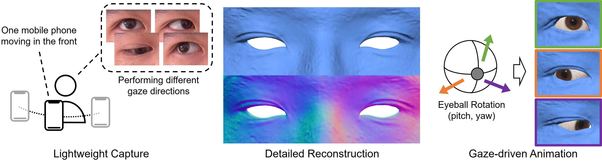

# High-quality Animatable Eyelid Shapes from Lightweight Captures

Official repository for SIGGRAPH Asia 2024 paper: [*High-quality Animatable Eyelid Shapes from Lightweight Captures*](https://arxiv.org/abs/2410.01360).

 

* Coordinated Control
<div align="center"></div>

* Separate Control
<div align="center"></div> 

* Blinking Insertion
<div align="center"></div>

# Installation
## Step 1: Create Conda Environment
```
# python=3.9 have been tested
conda create -n anieyelid python=3.9
conda activate anieyelid
```

## Step 2: Install Pytorch
Find the suitable version from [Previous Pytorch Versions](https://pytorch.org/get-started/previous-versions/).
```
# pytorch==1.8.0 with cudatoolkit=11.1 has been tested
conda install pytorch==1.8.0 torchvision==0.9.0 torchaudio==0.8.0 cudatoolkit=11.1 -c pytorch -c conda-forge
```

## Step 3: Install Other Tool Packages
```
pip install -r requirements.txt
```

# Data Preparation

The data is organized as follows:
```
<case_name>
|-- cameras_sphere.npz          # camera parameters
|-- parameters_merge_new.npz    # gaze parameters
|-- sample_points_merge.npz     # sampled eyeball vertices
|-- skip_frames.txt             # closed-eye frame
|-- rgb
    |-- 000.png        # rgb image
    |-- 001.png
    ...
|-- mask
    |-- 000.png        # face mask
    |-- 001.png
    ...
|-- eyemask
    |-- 000.png        # eyelid mask
    |-- 001.png
    ...
|-- irismask
    |-- 000.png        # iris mask
    |-- 001.png
    ...
|-- newmask
    |-- 000.png        # final mask
    |-- 001.png
    ...
```

## Get Preprocessed Data
You can download our preprocessed data from [Google Drive](https://drive.google.com/file/d/1D6aWXkvXZIiqLgT4oMgMA9V9T5bLduYA/view?usp=drive_link) for **ACADEMIC USE ONLY**.
```
|-- real_data
    |-- 001     # without skip_frames.txt (run with real.conf or real_split.conf)
    |-- 002     # with skip_frames.txt (run with real_close.conf or real_close_split.conf)
```

## Generate Your Own Data
Tutorial can be found in [data_preprocess](./data_preprocess).

# Running
## Configs
The confs are in `confs` directory.
```
real_reconly.conf       # for reconstruction only
real.conf               # rec + animation (coordinated control)
real_split.conf         # rec + animation (separate control)

# The confs as follows needs "skip_frames.txt"
real_close.conf         # advanced version of real.conf which supports closed-eye
real_close_split.conf   # advanced version of real_split.conf which supports closed-eye
```

## Training
```
python exp_runner.py --mode train --conf confs/$conf --case $case_name
```

## Testing
```
# generate reconstruction results
python exp_runner.py --mode validate --conf confs/$conf --case $case_name --is_continue

# generate animation results
python exp_runner.py --mode intergaze --conf confs/$conf --case $case_name --is_continue
```

## Geometry Rendering
- **Compiling renderer**
```
# step 1: replace $pybind_path in build.sh with your pybind path (e.g., "/.../anaconda3/envs/anieyelid/lib/python3.9/site-packages/pybind11/share/cmake/pybind11")
# step 2: run the following command
cd renderer && bash build.sh && cd ..
```
- Rendering meshes
```
# render reconstruction results
python geo_render_rec.py ./datasets/subject_1 exp/subject_1/ 120000 0

# render animation results
python geo_render_ani.py ./datasets/subject_1 exp/subject_1/ 120000
```

# TODO List
- [x] Tutorial of Data Preprocessing
- [ ] Code of Eyeball Calibration

# Acknowledgements
This repository is built upon [NeuS](https://github.com/Totoro97/NeuS), [NDR](https://github.com/USTC3DV/NDR-code), and [NeuDA](https://github.com/3D-FRONT-FUTURE/NeuDA). The code for geometry rendering is borrowed from [StereoPIFu](https://github.com/CrisHY1995/StereoPIFu_Code). We thank all the authors for their great work.

# Citation
If this repository helps your research, please cite it in your publications:

```
@inproceedings{lyu2024high,
  title={High-quality Animatable Eyelid Shapes from Lightweight Captures},
  author={Lyu, Junfeng and Xu, Feng},
  booktitle={SIGGRAPH Asia 2024 Conference Papers},
  pages={1--11},
  year={2024}
}
```
